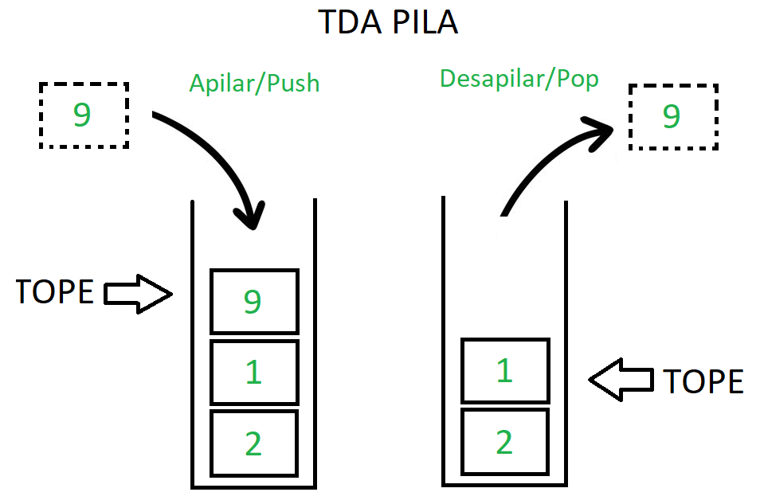

<div align="right">

</div>

# TDA LISTA

# ESTO ES UN TEMPLATE, COMPLETAR LO QUE HAGA FALTA, ELIMINAR LO QUE SOBRE (INCLUIDA ESTA LÍNEA)

## Alumno: (Nombre Apellido) - (Padrón) - (Mail)

- Para compilar:

```bash
línea de compilación
```

- Para ejecutar:

```bash
línea de ejecución
```

- Para ejecutar con valgrind:
```bash
línea con valgrind
```

---

##  Funcionamiento

Explicación de cómo funcionan las estructuras desarrolladas en el TP y el funcionamiento general del mismo.

Aclarar en esta parte todas las decisiones que se tomaron al realizar el TP, cosas que no se aclaren en el enunciado, fragmentos de código que necesiten explicación extra, etc.

Incluír **EN TODOS LOS TPS** los diagramas relevantes al problema (mayormente diagramas de memoria para explicar las estructuras, pero se pueden utilizar otros diagramas si es necesario).

### Por ejemplo:

El programa funciona abriendo el archivo pasado como parámetro y leyendolo línea por línea. Por cada línea crea un registro e intenta agregarlo al vector. La función de lectura intenta leer todo el archivo o hasta encontrar el primer error. Devuelve un vector con todos los registros creados.

<div align="center">

</div>

En el archivo `sarasa.c` la función `funcion1` utiliza `realloc` para agrandar la zona de memoria utilizada para conquistar el mundo. El resultado de `realloc` lo guardo en una variable auxiliar para no perder el puntero original en caso de error:

```c
int *vector = realloc(vector_original, (n+1)*sizeof(int));

if(vector == NULL)
    return -1;
vector_original = vector;
```


<div align="center">

</div>

---

## Respuestas a las preguntas teóricas

- ¿Qué es una lista/pila/cola? Explicar con diagramas.

## Pila/Stack

Una pila es un conjunto de elementos no ordenados, se utiliza para agrupar elementos y en particular se utiliza para agrupar elementos que tienen una politica de salida llamada **LIFO** "Last In, First Out", significa que el ultimo elemento en entrar es el primero en salir.
La unica forma de acceder a los elementos de la pila es a travez de su tope, por lo que siempre vamos a tener acceso y visibilidad hacia el tope de la pila y no hacia los elementos de abajo.

### Algunas Operaciones
- **Push (Apilar)**: Esta operación se utiliza para agregar un elemento nuevo en la parte superior de la pila. El nuevo elemento se coloca encima de los elementos existentes. Por lo tanto, la pila crece en tamaño.

- **Pop (Desapilar)**: Esta operación se utiliza para eliminar y devolver el elemento más recientemente agregado en la parte superior de la pila. Después de realizar un pop, la pila se reduce en tamaño.

- **Peek (Vistazo)**: Esta operación permite observar el elemento que está en la parte superior de la pila sin eliminarlo. Es útil para obtener información sobre el próximo elemento que se eliminará si se realiza una operación de pop.

- **Empty (Vacía)**: Esta operación comprueba si la pila está vacía, es decir, si no contiene ningún elemento. Si está vacía, generalmente devuelve un valor verdadero; de lo contrario, devuelve falso.

- **Size (Tamaño)**: Esta operación devuelve la cantidad de elementos presentes en la pila en un momento dado.

- **Create (Crear una pila)**: Esta operación implica inicializar una pila vacía. Dependiendo del lenguaje de programación que estés utilizando, puede haber diferentes formas de crear una pila.

- **Destroy (Destruir una pila)**: Esta operación implica liberar la memoria asignada a la estructura de datos de la pila una vez que ya no se necesita.

- **Empty (Está vacía)**: Esta operación comprueba si la pila está vacía, es decir, si no contiene ningún elemento. Si está vacía, generalmente devuelve un valor verdadero; de lo contrario, devuelve falso.

- **Is Full (Está llena)**: En algunas implementaciones de pilas, especialmente cuando se utilizan arreglos de tamaño fijo para almacenar los elementos, puede ser útil tener una operación para verificar si la pila está llena y no se puede agregar más elementos.


<div align="right">
    
</div>


