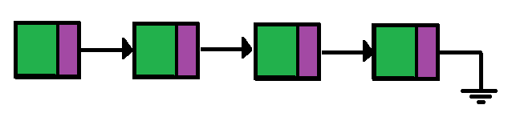
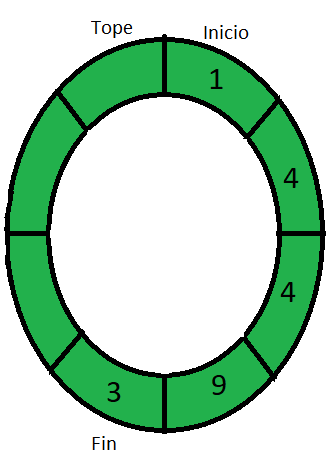
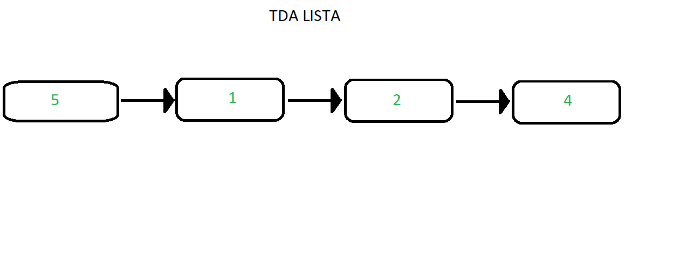
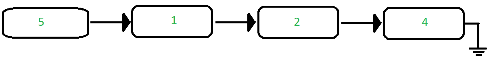
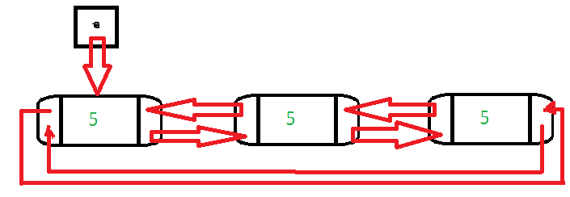
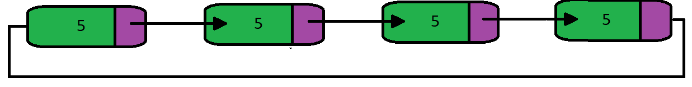

<div align="right">

</div>

# TDA LISTA

## Alumno: NICOLAS IGNACIO SCOPEL - 111305 - nscopel@fi.uba.ar

- Para compilar:

```bash
línea de compilación
```

- Para ejecutar:

```bash
línea de ejecución
```

- Para ejecutar con valgrind:
```bash
línea con valgrind
```

---

## Funcionamiento General:
El código implementa una lista enlazada genérica en C. Esta estructura de datos permite almacenar una secuencia de elementos de manera dinámica, es decir, su tamaño puede cambiar durante la ejecución del programa. La lista enlazada está compuesta por nodos, donde cada nodo contiene un elemento y un puntero al siguiente nodo en la secuencia.

## Proceso de Creación y Manipulación de la Lista:
- **Creación de la Lista (lista_crear):** Esta función inicializa una lista vacía, asignando memoria para la estructura lista_t.
- **Inserción de Elementos (lista_insertar, lista_insertar_en_posicion):** Permite añadir elementos a la lista. La función lista_insertar agrega un elemento al final de la lista, mientras que lista_insertar_en_posicion inserta un elemento en una posición específica.
- **Eliminación de Elementos (lista_quitar, lista_quitar_de_posicion):** Elimina elementos de la lista. lista_quitar elimina el último elemento, mientras que lista_quitar_de_posicion elimina un elemento en una posición dada.
- **Acceso a Elementos (lista_elemento_en_posicion, lista_primero, lista_ultimo):** Estas funciones permiten acceder a los elementos de la lista. lista_elemento_en_posicion devuelve el elemento en una posición dada, lista_primero devuelve el primer elemento, y lista_ultimo devuelve el último elemento.
- **Búsqueda de Elementos (lista_buscar_elemento):** Permite buscar un elemento en la lista utilizando una función comparadora.
- **Información de la Lista (lista_vacia, lista_tamanio):** Estas funciones proporcionan información sobre la lista, como si está vacía (lista_vacia) y su tamaño (lista_tamanio).
- **Destrucción de la Lista (lista_destruir, lista_destruir_todo):** Libera la memoria utilizada por la lista y sus elementos. lista_destruir solo elimina la lista, mientras que lista_destruir_todo además permite aplicar una función a cada elemento antes de liberarlos.

## Iteración sobre la Lista:
El código también proporciona funciones para iterar sobre los elementos de la lista mediante un iterador.
- **Iterador (lista_iterador_crear, lista_iterador_tiene_siguiente, lista_iterador_avanzar, lista_iterador_elemento_actual, lista_iterador_destruir):** Estas funciones permiten crear un iterador sobre la lista, verificar si tiene un siguiente elemento, avanzar al siguiente elemento, obtener el elemento actual y destruir el iterador.
---

## Respuestas a las preguntas teóricas

## ¿Qué es una lista/pila/cola?

## Pila/Stack

Una pila es un conjunto de elementos no ordenados, se utiliza para agrupar elementos y en particular se utiliza para agrupar elementos que tienen una politica de salida llamada **LIFO** "Last In, First Out", significa que el ultimo elemento en entrar es el primero en salir.
La unica forma de acceder a los elementos de la pila es a travez de su tope, por lo que siempre vamos a tener acceso y visibilidad hacia el tope de la pila y no hacia los elementos de abajo.

### Algunas Operaciones
- **Push (Apilar)**: Esta operación se utiliza para agregar un elemento nuevo en la parte superior de la pila. El nuevo elemento se coloca encima de los elementos existentes. Por lo tanto, la pila crece en tamaño.

- **Pop (Desapilar)**: Esta operación se utiliza para eliminar y devolver el elemento más recientemente agregado en la parte superior de la pila. Después de realizar un pop, la pila se reduce en tamaño.

- **Peek (Vistazo)**: Esta operación permite observar el elemento que está en la parte superior de la pila sin eliminarlo. Es útil para obtener información sobre el próximo elemento que se eliminará si se realiza una operación de pop.

- **Empty (Vacía)**: Esta operación comprueba si la pila está vacía, es decir, si no contiene ningún elemento. Si está vacía, generalmente devuelve un valor verdadero; de lo contrario, devuelve falso.

- **Size (Tamaño)**: Esta operación devuelve la cantidad de elementos presentes en la pila en un momento dado.

- **Create (Crear una pila)**: Esta operación implica inicializar una pila vacía. Dependiendo del lenguaje de programación que estés utilizando, puede haber diferentes formas de crear una pila.

- **Destroy (Destruir una pila)**: Esta operación implica liberar la memoria asignada a la estructura de datos de la pila una vez que ya no se necesita.

- **Empty (Está vacía)**: Esta operación comprueba si la pila está vacía, es decir, si no contiene ningún elemento. Si está vacía, generalmente devuelve un valor verdadero; de lo contrario, devuelve falso.

- **Is Full (Está llena)**: En algunas implementaciones de pilas, especialmente cuando se utilizan arreglos de tamaño fijo para almacenar los elementos, puede ser útil tener una operación para verificar si la pila está llena y no se puede agregar más elementos.


<p align="center">
    
</p>

### Implementaciones 

- **Vector estático**

<p align="center">
    
</p>

- **Vector dinámico**

<p align="center">
    
</p>

- **Pila como lista de nodos**

<p align="center">
    
</p>

## Cola/Queue

Al igual que la pila es un conjunto de elementos no ordenados, se utiliza para agrupar elementos y en particular se utiliza para agrupar elementos que tienen una politica de salida llamada **FIFO** "Fist In, Fist Out", que significa que el pimero que entra es el pimero que sale. Se insertan elementos por un lado y se sacan por el contrario.

### Algunas Operaciones
- **Crear**: La operación de crear se refiere a la inicialización de una nueva cola vacía. En este paso, se asignan los recursos necesarios para almacenar los elementos de la cola y se establecen las estructuras de datos necesarias para su funcionamiento.

- **Destruir**: La operación de destruir se encarga de liberar todos los recursos asignados a la cola y eliminarla por completo de la memoria. Esto se realiza para evitar fugas de memoria y liberar espacio una vez que la cola ya no se necesita.

- **Encolar (Enqueue)**: Esta operación consiste en agregar un nuevo elemento al final de la cola. El nuevo elemento se inserta después de todos los elementos existentes en la cola y se convierte en el último en ser eliminado siguiendo el principio FIFO.

- **Desencolar (Dequeue)**: La operación de desencolar se refiere a eliminar y devolver el elemento que se encuentra en la parte frontal de la cola. Esto implica extraer el elemento más antiguo que aún no ha sido eliminado de la cola, siguiendo el principio FIFO.

- **Primero (Front)**: Esta operación devuelve el elemento que se encuentra en la parte frontal de la cola sin eliminarlo. Es decir, devuelve el primer elemento que se insertó en la cola y que aún no ha sido eliminado.

- **Vacío (Empty)**: La operación de vacío se utiliza para verificar si la cola está vacía o no. Devuelve verdadero si la cola no contiene ningún elemento y falso si la cola contiene al menos un elemento.

<p align="center">
    
</p>

### Implementaciones 

- **Vector estático**

<p align="center">
    
</p>

- **Vector dinámico**

<p align="center">
    
</p>

- **Pila como lista de nodos**

<p align="center">
    
</p>

## Lista/List

Lista es una estructura de datos que organiza elementos en una secuencia, donde cada elemento, excepto el primero, tiene un predecesor, y cada elemento, excepto el último, tiene un sucesor. A diferencia de estructuras como pilas (**LIFO**) y colas (**FIFO**), en una lista se puede acceder a cualquier elemento de forma directa. Esto la hace versátil para diversas operaciones como inserción, eliminación, búsqueda y modificación de elementos.

### Algunas Operaciones

- **Crear (Create):** Inicializa una lista vacía, lista para almacenar elementos.
  
- **Insertar (InsertAT):** Agrega un nuevo elemento a la lista en una posición específica.
  
- **Eliminar (DeleteAT):** Elimina un elemento de la lista en una posición específica.
  
- **Buscar (Search):** Busca un elemento específico en la lista y devuelve su posición si se encuentra.
  
- **Tamaño (Size):** Devuelve la cantidad de elementos presentes en la lista.
  
- **Acceder (Access):** Devuelve el elemento en una posición específica de la lista.
  
- **Actualizar (Update):** Modifica el valor de un elemento en una posición específica de la lista.
  
- **Concatenar (Concatenate):** Combina dos listas en una sola lista.
  
- **Ordenar (Sort):** Ordena los elementos de la lista según un criterio específico (por ejemplo, orden numérico o alfabético).
  
- **Invertir (Reverse):** Invierte el orden de los elementos en la lista.
  
<p align="center">
    
</p>

### Implementaciones 

- **Vector estático**

<p align="center">
    
</p>

- **Vector dinámico**

<p align="center">
    
</p>

- **Lista de Nodos**
  
  - Simplemente enlazada
    <p align="center">
    
    </p>
    
  - Doblemente enlazada
    
    <p align="center">
    
    </p>
    
  - Circular
    <p align="center">
    
    </p>

